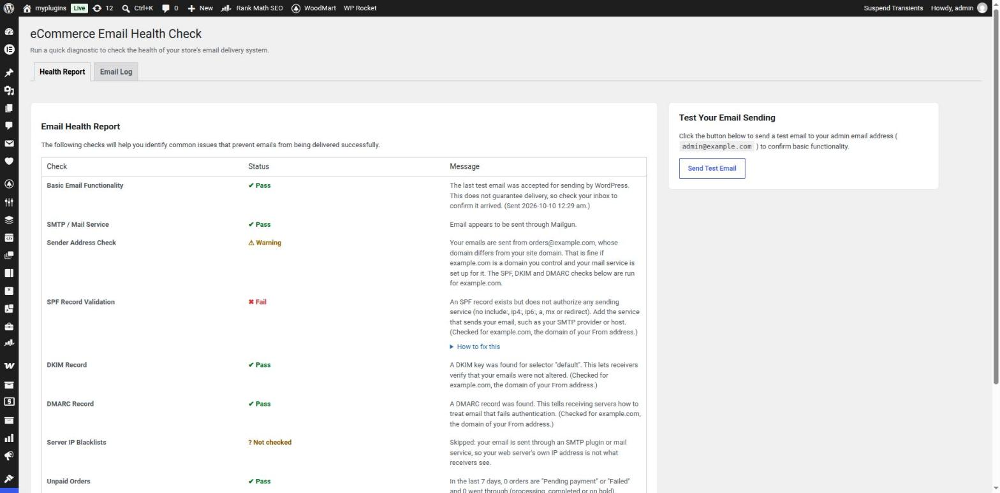
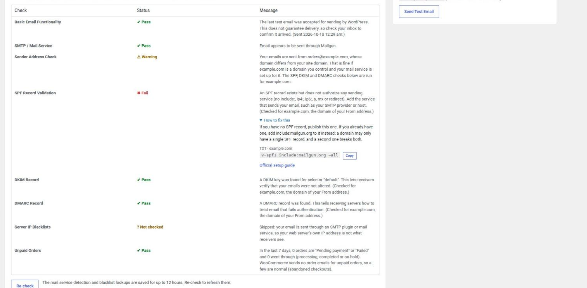
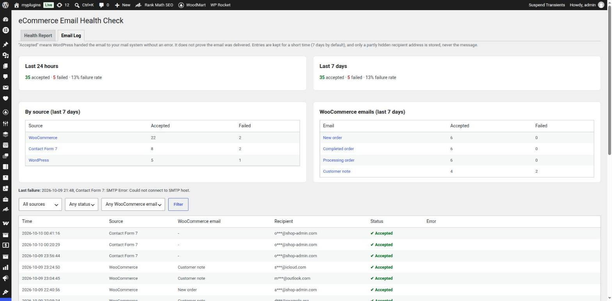
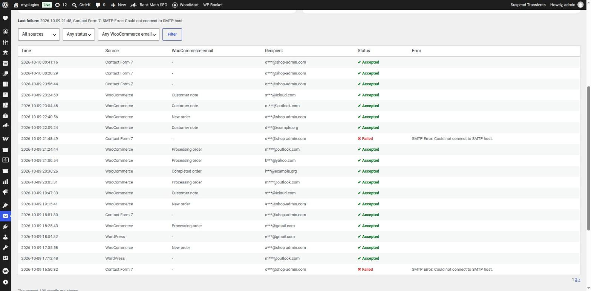
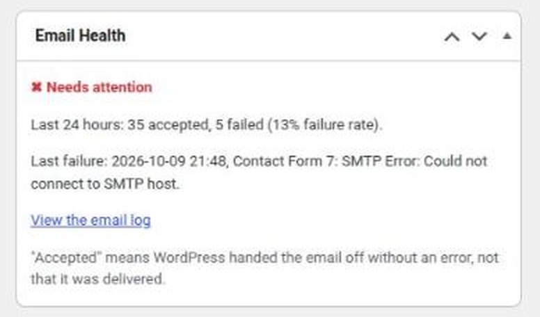
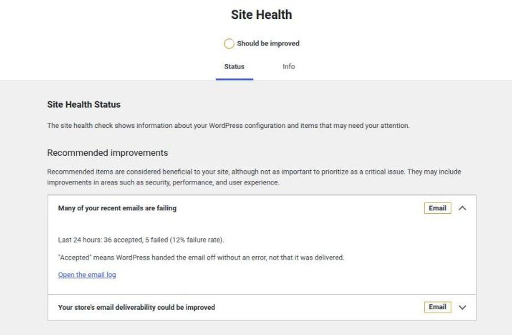

# Email Health Check & Log for WooCommerce – SPF, DKIM, DMARC & Alerts

[](https://wordpress.org/plugins/ecom-email-health-check/)
[](LICENSE)

Email log, SPF/DKIM/DMARC checks and failure alerts. Find out why WooCommerce order emails go to spam or never arrive.

> This is the development repository. The released plugin lives on [WordPress.org](https://wordpress.org/plugins/ecom-email-health-check/); its description and FAQ are in [`readme.txt`](readme.txt), which this page mirrors.

## The problem

WooCommerce emails not sending, or landing in spam? Many hosts have poor email setups that fail silently, so you and your customers never find out why an order confirmation did not arrive.

## What it does

Email Health Check looks at how your WordPress or WooCommerce site sends email and tells you what is wrong in plain language: SPF, DKIM and DMARC problems, mail sent through plain PHP mail, a blacklisted server IP, order emails that are switched off or stuck behind unpaid orders, and more. It also keeps an email log of what your site sends. It is free, needs no account, and sends no email content or personal data to any service. The only outside lookup is an optional server IP blacklist check (see "External services" in [`readme.txt`](readme.txt)).

### Diagnose

* **Email Health Report:** one page with a Pass, Warning or Fail status for each check. The page opens at once and the checks (including the DNS lookups) run in the background.
* **Getting-started checklist** for new installs, and **Copy support report** (versions, domains, check results; no passwords, message contents or full email addresses).
* **Sending test** to your own address or any inbox you want to try, with an optional subject.
* **SMTP / mail service:** warns when mail goes out through plain PHP mail, and names the plugin that handles your outgoing email.
* **Sender address, SPF, DKIM and DMARC**, checked for the domain you actually send from.
* **Server IP blacklists** (DroneBL and PSBL) when you send straight from your server.
* **WooCommerce email setup** (turned-off emails, recipient, From address, outdated theme overrides) and **unpaid orders** (WooCommerce sends no order email for "Pending payment" or "Failed" orders).

### Email log and failure alerts

* **Email Log and statistics:** every email your site sends, with source, WooCommerce email type, status and error; filters; accepted and failed counts for 24 hours and 7 days. Only a partly hidden recipient address is stored, never the message. Retention, switching off and clearing are in the Email Log tab.
* **Failure alerts in wp-admin:** an "Email Health" dashboard widget and a Site Health test, with no email needed.

### Fix

* **"How to fix this" panels:** a copy-paste DNS record where the provider documents one, and a link to the provider's official guide (SendGrid, Mailgun, Brevo, Postmark, Amazon SES, SparkPost, Mailjet, Elastic Email, Google Workspace, Microsoft 365).

### WP-CLI

```
wp ehc check            # runs all checks, exit status 1 if one fails (--format=json for scripts)
wp ehc log              # recent logged emails (--source --status --type --limit)
wp ehc log --stats      # accepted and failed counts for 24 hours and 7 days
```

## Screenshots

| | |
|---|---|
|  |  |
|  |  |
|  |  |

## Installation

Search for "Email Health Check" under `Plugins > Add New` and click Install and Activate, or download it from the [WordPress.org plugin page](https://wordpress.org/plugins/ecom-email-health-check/) and upload the `ecom-email-health-check` folder to `/wp-content/plugins/`. After activation the plugin opens its own top-level **Email Health Check** menu.

## Development

* PHP 7.4+ and WordPress 5.0+ (the email log needs WordPress 5.9+). No build step, no Composer or npm.
* Namespace `CodeSir\EmailHealthCheck`, PSR-4 autoloaded from `includes/`. Layout and conventions: [`CLAUDE.md`](CLAUDE.md).
* Tests for the pure logic need nothing installed: `php tests/run.php` (add a test for every bug fix).
* Before a release run the official [Plugin Check](https://wordpress.org/plugins/plugin-check/) on a copy built with `.distignore`, and follow [`docs/compatibility.md`](docs/compatibility.md). The `Checks` workflow does lint, tests and Plugin Check on every pull request.
* Git flow: pull requests go to `develop`; a release is a `develop` to `trunk` pull request followed by a tag, which deploys to WordPress.org.
* Translations: `languages/ecom-email-health-check.pot`; community translations happen on [translate.wordpress.org](https://translate.wordpress.org/projects/wp-plugins/ecom-email-health-check/).

## Contributing

Bug reports, feature requests and pull requests are welcome: please open an issue on this repository first. Support questions are best asked in the [plugin's support forum](https://wordpress.org/support/plugin/ecom-email-health-check/).

## License

GPL v2.0 or later. See the [LICENSE](LICENSE) file.
